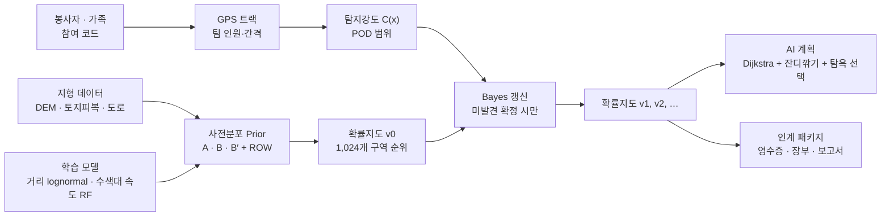
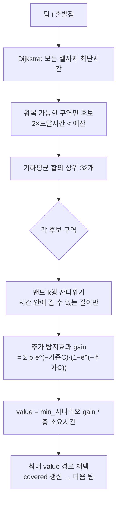

# 천라지망 기술 Q&A 대비 자료

본선 질의응답에서 "이 프로그램이 왜 이렇게 계산하는가"를 팀원이 직접 설명하기 위한 학습 자료다. 수식과 알고리즘 이름은 영어로 두고, 설명은 한국어로 쓴다. 모든 수치는 2026-09-20 기준 실제 코드(`backend/`)와 학습 결과(`models/fa9c4ef…/evaluation.json`)에서 가져왔다.

---

## 0. 30초 안에 말할 수 있어야 하는 문장

- 천라지망은 **위치를 맞히는 AI가 아니라, 어디를 얼마나 믿을 수 있게 확인했는지 증명하는 도구**다.
- 지도는 세 가지 가설(A: 학습된 거리 분포, B: 지형 시뮬레이션, B′: 행동 규칙 변형)을 같이 돌려 만든다. 한 장의 정답 지도를 그리지 않는다.
- 수색 기록은 **POD (Probability of Detection)** 범위로 바뀌고, **Bayes' rule**로 "미발견" 증거만 지도에 반영한다.
- 학습한 것은 둘이다. 실제 실종 사건 65건의 발견 거리 분포(lognormal)와 수색대 GPS 61트랙의 이동 속도(Random Forest). 나머지는 가정이고, 앱이 표로 구분해 보여 준다.
- 검증은 **pre-registration**(기준을 먼저 적고 나중에 평가) 방식이고, 기준에 못 미친 모델 두 개는 미채택으로 남겼다.

---

## 1. 시스템 한눈에



버전이 바뀌는 순간은 딱 하나, 조정자가 "완료·미발견"을 확정할 때다. 업로드, 단서 기록, 계획 확정, 시간 미리보기는 지도를 바꾸지 않는다. 이 원칙이 "증명"의 핵심이다. 지도가 왜 이 모양인지 언제나 영수증(SHA-256)으로 거슬러 올라갈 수 있다.

---

## 2. 확률지도의 수학

### 2.1 확률 상태 (Distribution)

한 임무의 확률 상태는 `Distribution(grid, outside)`다.

- `grid`: 512 × 512 배열. 셀 하나는 30 m × 30 m. 셀 (i, j)의 값은 대상이 그 셀에 있을 확률 p_ij. 이 창은 제주도 전체 3,200 × 2,368 마스터 격자에서 마지막 확인 위치를 중심으로 64셀 격자점에 맞춰 잘라낸다(`core.Master.window_origin`). 원래의 한림읍 창은 마스터의 (704, 448) 위치에 그대로 들어 있다.
- `outside`: 격자 밖 + 모형 밖(ROW)에 있을 확률.
- **불변식 (invariant):** Σ_ij p_ij + outside = 1. 모든 연산 뒤에 `check()`가 이 식을 검사한다(허용 오차 1e−8). 음수·NaN도 금지.

왜 `outside`를 따로 두는가. 확률을 격자 안으로 억지로 정규화하면 "지도 밖에 있을 리 없다"는 가정이 몰래 들어간다. 지도 밖 몫을 숫자로 유지해야 "낮은 확률은 부재의 증거가 아니다"를 계산으로 지킬 수 있다.

### 2.2 시나리오 A — 학습된 발견 거리 분포 (lognormal)

**정의.** 확률변수 R (마지막 확인 위치에서 발견점까지의 거리)이 lognormal(μ, σ)이라는 것은 ln R ~ Normal(μ, σ²)라는 뜻이다. 확률밀도함수는

  f(r) = 1 / (r σ √(2π)) · exp( −(ln r − μ)² / (2σ²) ),  r > 0.

scipy 표기로는 `lognorm(s=σ, loc=0, scale=e^μ)`. 학습 결과(`endpoint.json`): s = 0.6948, scale = 2436.9 m.

**왜 lognormal인가.** 거리는 항상 양수이고, 대부분은 몇 km 안에서 발견되지만 가끔 수십 km 사례가 있다(오른쪽 꼬리가 길다). 이런 "양수 + 오른쪽 꼬리" 자료의 표준 모델이 lognormal이다. 대안으로 Rayleigh(2차원 정규분포의 반지름 분포)도 같이 적합했는데, 사건 하나씩 제외한 교차검증 NLL이 lognormal 8.877 < Rayleigh 9.039로 lognormal이 더 나았다.

**적합 (Maximum Likelihood Estimation).** 65개 거리 r₁…r₆₅에 대해 ln rᵢ의 표본평균이 μ̂, 표본표준편차가 σ̂이다(lognormal의 MLE는 로그를 취한 뒤 정규분포 MLE와 같다). 이 결과 median = e^μ = 2437 m.

**분위수 반경 공식.** 누적확률 q에 해당하는 반경은

  r_q = scale · exp( s · Φ⁻¹(q) ),  Φ⁻¹은 표준정규분포의 quantile function.

  r₀.₈ = 2437 · exp(0.6948 × 0.8416) ≈ 4.37 km, r₀.₉₅ = 2437 · exp(0.6948 × 1.645) ≈ 7.64 km.

**검증 수치의 의미.** "80% 반경 안에 실제 발견점이 들어온 비율 72.3%"는 leave-one-case-out으로, 사건 하나를 빼고 64건으로 적합한 뒤 그 사건의 발견점이 80% 반경 안에 있는지 센 것이다. 이상적으로 보정(calibrated)됐다면 80%여야 한다. 72.3%는 조금 좁게 예측한다는 뜻이고, 그래서 "보정 완료"라고 말하지 않는다.

**도달 가능 반경 절단 (reach cap).** 65건 자료에는 경과 시간이 없다. 그래서 경과시간 t에 걸어서 갈 수 없는 거리(r > 5 km/h × t)는 표본에서 제외(rejection sampling)하고 나머지를 다시 정규화한다. 이것은 시간 정보를 "없는 데서 만들어내는" 것이 아니라, 물리적으로 불가능한 부분만 잘라내는 최소한의 처리다.

**격자로 옮기기.** 거리 r을 뽑고 방향 θ ~ Uniform(0, 2π)를 뽑아 (r cos θ, r sin θ)를 마지막 확인 위치에 더한다. 위치 불확실성 σ_pos(기본 50 m)의 정규 난수도 더한다. 10만 개 표본을 셀별로 세어 히스토그램을 만든다. 방향을 균등으로 두는 이유는 학습 자료에 방향 정보가 없기 때문이고, 지형에 따른 방향 선호는 B가 담당한다.

**한계(반드시 먼저 말할 것).** 미국 하이커 표본이고, 원 논문이 1 km 미만 사건을 대부분 제외했다. 따라서 근거리 확률을 낮게 볼 수 있다(모델의 P(R < 1 km) ≈ 10%). 우리는 이를 감추지 않고 근거리는 B/B′가 담당하도록 설계했다.

### 2.3 시나리오 B — 지형 몬테카를로 (Monte Carlo particle simulation)

**Tobler's hiking function.** 경사 S = dh/dx (높이 변화/수평 거리, 무차원)에서 보행 속도는

  v(S) = 6 · exp( −3.5 · |S + 0.05| ) km/h = 1.667 · exp( −3.5 · |S + 0.05| ) m/s.

평지(S=0)에서 6·e^(−0.175) ≈ 5.04 km/h, 약간 내리막(S=−0.05)에서 최대 6 km/h, 오르막 S=0.2에서 6·e^(−0.875) ≈ 2.5 km/h. 1993년 Tobler가 경험 자료로 제안한 함수로, 지형 분석에서 널리 쓰인다.

**이동비용 격자.** 여기에 토지피복 계수(나무 0.48, 관목 0.65, 농경지 0.8, 도로 30 m 이내 1.05, 그 외 1.0)와 실종자 이동성 계수 0.42를 곱한다. 0.42는 "실종자는 등산객처럼 계속 걷지 않는다"는 팀 가정이다(학습 아님).

**입자 시뮬레이션.** 입자 20,000개가 마지막 확인 위치(± σ_pos)에서 출발해 8방향 격자 위를 걷는다. 매 걸음:

1. 현재 방향에서 회전 Δ ∈ {−2, −1, 0, +1, +2} (45° 단위)를 확률 [.14, .20, .32, .20, .14]로 뽑는다.
2. 다음 셀까지의 소요 시간 τ = 거리 / v. 남은 시간이 τ 이상이면 이동, 아니면 정지.
3. 수역이나 45° 초과 경사에 도착한 입자는 **종착(terminal)** 상태가 된다. 확률은 사라지지 않고 그 셀에 남는다. (통행 불가 ≠ 존재 불가. 물에 빠진 사람은 물에 있다.)
4. 격자를 벗어난 입자는 `outside`로 센다.

시간 예산이 끝나면 입자 위치를 셀별로 세어 히스토그램을 만든다. seed를 고정하므로 같은 입력은 항상 같은 지도를 만든다(영수증에 seed 기록).

### 2.4 시나리오 B′ — 행동 규칙 변형

같은 시뮬레이션(같은 seed)에 세 가지 선호를 켠다.

- 회전 분포를 [.08, .14, .56, .14, .08]로 바꿔 직진 성향을 높인다.
- 후보 이동을 확률 min(1, exp(favor))로 받아들인다. favor = (도로까지 거리 감소량)/90 − 경사 + 시설 인력. 도로에 가까워지고 내리막이며 시설 쪽이면 favor > 0 → 항상 이동. 반대면 확률적으로 거절하고 30초를 소비한다(멈춰 서서 망설이는 것에 해당).
- 시설 인력은 OSM 시설 630곳까지의 지형 이동비용으로 만든 퍼텐셜 장의 기울기다(`facilities.py`). 강도는 0~1 조절, 기본 0.6.

B와 B′는 독립 모델이 아니라 **연관 시나리오**(같은 난수)다. 그래서 두 결과의 차이는 순전히 행동 규칙 때문이지 난수 때문이 아니다.

### 2.5 종합 지도와 합의 규칙

종합 표시: P_mix = ½ A + ¼ B + ¼ B′ (가중치는 팀 가정, 영수증에 기록).

구역 순위는 세 시나리오의 구역 확률 m_A, m_B, m_B′의 **기하평균 (geometric mean, log-linear pooling)**으로 정한다.

  score = (m_A · m_B · m_B′)^(1/3).

왜 평균이나 최소값이 아닌가.

- 산술평균(=종합 지도 값)은 한 시나리오만 아주 크면 나머지가 0이어도 높다. "여러 가설에서 모두 유효한 곳" 원칙에 어긋난다.
- 최소값은 세 가설이 모두 유효해야 하지만, 가장 비관적인 한 가설이 순위를 완전히 지배한다. 학습된 A는 근거리를 낮게 보므로(2.2 한계) 최소값 규칙에서는 마지막 확인 위치 근처가 무조건 밀린다.
- 기하평균은 어느 하나가 0이면 0이 되어 "모두 유효" 조건을 지키면서, 한 가설의 비관이 전체를 지배하지 않는다. log를 취하면 세 로그확률의 평균이라 **log-linear pooling**이라고 부른다.

카드에 표시하는 **합의도 (agreement)** = min / max. 1에 가까우면 세 가설이 같은 값을 주고, 0에 가까우면 어느 한 가설이 반대한다는 뜻이다.

### 2.6 ROW — 모형 밖 잔여확률 (Rest of World)

수색 이론에서는 계획한 구역 어디에도 없을 확률을 ROW로 따로 둔다. 차량으로 이동했거나, 신고된 마지막 위치가 틀렸거나, 모형이 상상하지 못한 경우다. 천라지망은 임무 생성 시 row(기본 10%, 0~50% 조절)를 떼어

  grid ← (1 − row) · grid,  outside ← row + (1 − row) · outside

로 예약한다(`with_row`). 왜 필요한가. 임무 창은 한 변 15.36 km라 8시간 걸어도 창을 벗어나기 어렵다. ROW가 없으면 "지도 밖 0.00%"가 뜨는데, 이는 "밖에 없다"가 아니라 "모형이 밖을 상상하지 않았다"는 뜻일 뿐이다. ROW를 두면 아래 2.7의 갱신에서 수색이 실패할수록 ROW가 자동으로 커진다.

### 2.7 Bayes 갱신 — 미발견 증거

셀 x에 대상이 있을 사전확률 p(x), 그 셀의 탐지강도 C(x) (3장), 셀에 대상이 있는데 못 찾을 확률 = e^(−C(x)) (3.1에서 유도). "수색했는데 못 찾았다"는 사건을 N이라 하면 Bayes' rule:

  p(x | N) = p(x) · P(N | x) / P(N) = p(x) · e^(−C(x)) / Z,
  Z = Σ_y p(y) e^(−C(y)) + outside.

ROW·격자 밖 몫은 수색하지 않았으므로 P(N | outside) = 1, 분자가 그대로 outside다. 그래서 Z < 1이 되어 outside/Z > outside, 즉 **수색이 실패하면 지도 밖 확률이 커진다**. 코드 `update()`가 정확히 이 식이고, 결과가 다시 `check()`를 통과한다.

**증명(질량 보존).** Σ_x p(x)e^(−C(x))/Z + outside/Z = (Σ_x p(x)e^(−C(x)) + outside)/Z = Z/Z = 1. ∎

**왜 승인된 기록만 반영하는가.** 업로드된 기록이 "수색을 끝냈고 못 찾았다"는 사실을 담보하지 않기 때문이다. 중간에 멈췄거나, 다른 팀 기록일 수도 있다. 사람이 N을 확정해야 Bayes 갱신의 조건(사건 N이 실제로 일어남)이 성립한다.

---

## 3. 탐지확률 (POD)의 수학

### 3.1 Sweep width와 random search formula

**Sweep width W (Koopman).** 수색자가 지나갈 때 좌우로 유효하게 탐지하는 폭. 실제 탐지는 거리에 따라 확률이 줄지만, "그 확률 곡선의 면적"을 하나의 폭으로 요약한 것이 W다. 문헌의 육상 수색 W는 대상·식생에 따라 수 m에서 수십 m라서 우리는 8·15·22 m 세 가지를 가정으로 쓴다.

**Coverage.** 면적 A인 구역을 총 길이 L만큼 걸으면 coverage C = W·L / A. C = 1이면 "폭 W로 구역을 정확히 한 번 훑을 만큼의 노력"이다.

**Random search formula 유도.** 수색 경로가 구역 안에서 충분히 무작위하다고 하자. 대상이 있는 지점을 수색자의 탐지 폭이 덮는 횟수는 평균 C인 Poisson 분포를 따른다(길이 L을 잘게 나눈 조각 각각이 그 지점을 덮을 확률이 작고 독립). Poisson(C)에서 0회일 확률은 e^(−C). 따라서

  POD = 1 − e^(−C).

C = 1이면 POD = 63%, C = 2면 86%. 완벽한 평행 수색이면 C = 1에서 100%가 되겠지만, 실제 팀은 흔들리고 겹치므로 e^(−C)가 보수적이고 현실적이다. (Koopman 1946, 미 해군 수색 이론.)

### 3.2 GPS 트랙 → 셀 탐지강도 C(x)

1. 인접 두 점 사이 구간마다 길이와 시간차를 계산한다. 시간차 > 120초는 공백(GPS 끊김)으로 제외, 속도 < 0.08 m/s 또는 > 3 m/s 또는 길이 > 250 m는 비정상으로 제외한다. 제외 구간에는 실선을 긋지 않는다.
2. 구간을 5 m 조각으로 나눠 각 조각의 길이를 주변 4개 셀에 bilinear 가중으로 나눠 준다. 이렇게 셀별 "걸은 길이" ℓ(x)를 모은다.
3. effort(x) = ℓ(x) / (30 m × 30 m). 이것을 GPS 오차 σ = 10 m의 Gaussian kernel로 부드럽게 한다. 커널은 정규화되어 있어서 **총 노력의 합은 변하지 않는다**(노력을 옮길 뿐 새로 만들지 않는다).
4. C_W(x) = W · effort(x), W ∈ {8, 15, 22}. 세 배열을 저장하고, 지도 갱신에는 가운데 15 m를, 표시에는 8 m(하한)·22 m(상한)를 쓴다.

효과 확인: 30 m 셀 한 칸을 정확히 한 번 가로지르면 ℓ = 30 m, effort = 30/900 = 1/30 /m, C₁₅ = 0.5 → POD 39%. 두 번 지나면 C = 1 → 63%.

### 3.3 팀 밴드 (team band)

기록한 사람 옆에 (n − 1)명이 간격 s로 나란히 걸었다면:

- 총 탐지 노력은 n배: 각 대원이 자기 W를 갖고 걷는다.
- 노력은 폭 b = (n − 1)·s에 퍼진다. 폭 b의 균일분포의 분산은 b²/12 (증명: 구간 [−b/2, b/2]에서 x²의 평균 = (1/b)∫x²dx = b²/12). 그래서 GPS 커널의 σ² = 10² + b²/12로 넓혀 옆으로 퍼뜨린다.
- 가정: 기록자가 밴드 가운데를 걸었고, 밴드 안 밀도가 균일하다. 이것을 앱과 보고서에 "가정"으로 표시한다.

```
        ←── b = (n−1)·s ──→
   ●····●····●····●····●····●     n = 6명, s = 15 m → b = 75 m
              ↑ 기록 GPS
   각 ●가 폭 W로 탐지 → 총 노력 n·W·L
```

계획기에서는 같은 가정을 격자로 옮긴다. 밴드가 k = round(b / 30) 행을 덮으면(최소 1), 팀은 k행마다 한 번씩 잔디깎기 패턴으로 걷고 각 행에 n/k 배의 노력을 준다. 6명·15 m → k = 2 → 한 번 지나갈 때 행 두 줄이 C₁₅ = 15·(6/2)/30 = 1.5 → POD 78%. 그래서 6명 팀은 480 m 구역을 60분에 훑고, 혼자서는 같은 시간에 열 몇 줄만 훑는다.

### 3.4 구역 POD와 표시 범위

구역 z의 POD는 사전확률로 가중한 셀 탐지확률이다.

  POD_z = Σ_{x∈z} p(x)(1 − e^(−C(x))) / Σ_{x∈z} p(x).

"이 구역에 있었다면 찾았을 확률"이다. 8 m로 계산한 값을 하한, 22 m 값을 상한으로 보여 준다. 이것은 **가정에 따른 범위**이지 통계적 신뢰구간이 아니다. 질문이 나오면 이 구분을 분명히 말한다.

### 3.5 독립성 가정과 한계

서로 다른 수색 회차의 탐지는 조건부 독립이라고 가정한다(강도가 더해진다). 같은 좌표 경로를 다시 올리면 중복으로 차단한다. 실제로는 같은 팀이 같은 실수를 반복하거나(상관), 첫 수색이 흔적을 남겨 두 번째가 쉬워지는 일이 있다. 이 보정은 실측 자료가 있어야 가능하고, 그것이 본선 전 모의 수색 실험의 목적이다.

---

## 4. 시간 추정

### 4.1 가중 질량 패킷과 일관된 난수

저장된 사후분포의 각 점유 셀에서 가중 경로 두 개를 출발시킨다(질량의 절반씩). 입자를 다시 무작위로 뽑지 않으므로 t = 0에서 표본 잡음이 없다. 난수는 (토큰, 걸음 수, seed, salt)를 섞은 counter-based hash로 만든다. 그래서 +30분과 +120분을 따로 계산해도 처음 30분의 경로가 같다 — 시간 슬라이더를 움직일 때 지도가 무작위로 흔들리지 않는다.

### 4.2 낮·밤 계수

태양고도를 NOAA 공식으로 분 단위 계산해 밤이면 이동에 쓰는 시간에 계수 0.6(조절 가능)을 곱한다. 즉 밤 60분은 낮 36분어치만 걷는다. 계수 자체는 가정이다.

### 4.3 관찰 시각 재생

실종·기준 시각이 있는 임무에서는 승인된 GPX를 관찰 시각 순서로 60초 구간에 묶고, 경로를 앞으로 굴리면서 각 구간 시각에 그 위치의 탐지강도만큼 생존 가중치를 깎는다:

  w ← w · exp( −C_t(x_t) ).

승인 버튼을 누른 시각이나 업로드 순서는 결과에 영향이 없다(파일 바이트로 정렬). 미래 관찰을 과거 화면에 쓰지 않는다.

---

## 5. AI 계획

### 5.1 수색대 속도 모델 (Random Forest regression)

- 자료: 실제 수색 사건의 수색대 GPS 61트랙, 45,141구간 중 44,285구간(공백·비정상·경사 결측 제외).
- 입력 특성 4개: |경사|, 그리고 수색 방식 one-hot (hasty, sweep, paired). 목표: 구간 속도 m/s.
- **Random Forest**: 결정트리(decision tree) 64개를 서로 다른 부트스트랩 표본으로 학습해 예측을 평균하는 앙상블. 트리 하나는 특성 임계값으로 자료를 반복 분할해 잎마다 평균 속도를 저장한다. 평균을 내면 분산이 줄어 과적합이 완화된다.
- 평가: **GroupKFold**로 team_id 8묶음을 나눠, 평가 팀의 구간이 학습에 절대 들어가지 않게 했다. 행 단위 무작위 분할을 하면 같은 사람의 인접 구간이 학습·평가 양쪽에 들어가 성능이 부풀려진다(data leakage).
- 결과: 트랙별 MAE 0.253 m/s. 비교 기준(방식별 중앙값 상수) 0.279 m/s. 9% 개선이며 크지 않다 — 이 모델의 역할은 "경사가 심하면 얼마나 느려지는가"를 자료로 정하는 것이지, 정확한 속도 예측이 아니다.
- 배포: 학습된 트리를 JSON으로 내보내고 서버는 NumPy로 직접 순회한다. pickle을 쓰지 않는 이유는 pickle이 임의 코드를 실행할 수 있기 때문이다. sklearn 원본 예측과 전체 학습 입력에서 최대 차이 0을 확인했다.

### 5.2 최단시간 경로 (Dijkstra's algorithm)

512 × 512 = 262,144개 셀을 노드로, 4방향 인접을 간선으로 둔다. 간선 비용 = 30 m / v, v는 RF 속도(경사별 표, 0.001 단위 양자화) × 토지피복 계수, 0.05~1.5 m/s로 절단. 수역·30° 초과 경사·자료 없음 셀은 노드에서 제외한다(위험 셀 통과 금지, 대각선 통과 금지). 출발 셀에서 모든 셀까지의 최단시간을 Dijkstra로 한 번 계산하면(scipy.sparse.csgraph) 모든 후보 구역의 이동·복귀 시간을 바로 읽을 수 있다.

### 5.3 후보 선택과 탐욕 알고리즘 (greedy)



- gain은 시나리오마다 따로 계산하고 **가장 낮은 시나리오 값**을 쓴다(세 가설 모두에서 의미 있는 경로만 좋게 본다).
- 앞 팀이 훑은 셀은 e^(−기존 C)만큼 가치가 줄어 뒤 팀은 자연히 다른 곳으로 간다(diminishing returns).
- 전역 최적(global optimum)이 아니다. 팀 4개 × 후보 32개 × 패턴 2개를 순서대로 고르는 탐욕 근사이며, 이 사실을 결과 JSON의 `assumptions`에 적는다.

### 5.4 이동 표적 계획 (coherent timed paths)

시간 미리보기 상태에서는 4.1의 가중 경로를 15초 간격으로 기록해 두고, 수색대가 셀 x를 방문하는 시각 t에 **그 시각에 x에 있는 경로들의 가중치**만 탐지효과로 센다. 같은 경로를 두 팀이 다른 시각에 만나면 생존도 e^(−C₁)·e^(−C₂)로 곱해 중복을 뺀다. 경로 수가 메모리 예산(256 MiB)을 넘으면 층화 표집하고 그 사실을 경고로 표시한다.

---

## 6. 학습 평가 방법론

- **NLL (negative log-likelihood)**: 평가 사건의 관측값에 모델이 준 확률밀도의 −log. 낮을수록 좋다. 서로 다른 단위(연속 거리 vs 구간 vs 구역 질량)의 NLL은 직접 비교하지 않는다.
- **Leave-one-case-out**: 사건 65개 각각을 빼고 64개로 적합 → 뺀 사건 평가. 사건 단위 일반화를 본다.
- **Spatial block CV**: 위도·경도 1° 블록(65건) 또는 27개 공간 블록(YOSAR)으로 나눠, 인접 사건이 학습·평가에 함께 들어가는 공간 누출을 막는다.
- **Bootstrap**: 블록을 복원추출해 2,000번 재계산한 차이의 분위수 범위. 범위가 0을 포함하면 "개선을 확신할 수 없다".
- **Pre-registration**: 채택 조건(예: "bootstrap 상한이 0 미만")을 학습 전에 문서(`AI-*-사전검증계획.md`)에 고정한다. 결과를 본 뒤 조건을 바꾸지 않는다. 그래서 지형 계수 모델(NLL 7.628→7.613, 범위 −0.061~+0.055)과 GeoLife 보행 모델(평가 인원 5명)은 **NOT_ADOPTED**로 남았다. 이 두 결과는 실패가 아니라 "이 자료로는 이 결론을 내릴 수 없다"는 증거이며, 지우지 않고 앱의 구성요소 표에 그대로 보여 준다.

질문 "그럼 AI가 별로 한 게 없는 것 아닌가요?"에 대한 답: 학습이 바꾸는 것은 지도의 거리 척도(A)와 경로의 시간 척도(RF)다. 나머지는 확률 추론(Monte Carlo + Bayes)이고, 이 프로젝트의 주장은 "AI가 위치를 안다"가 아니라 "무엇을 알고 무엇을 모르는지 계산이 정직하다"이다. 데이터가 없는 곳에 학습을 억지로 넣지 않은 것이 설계다.

---

## 7. 데이터

| 자료 | 규모 | 출처·라이선스 | 쓰임 |
|---|---|---|---|
| 실제 실종 하이커 사건 | 65건, IPP·발견점 좌표 | Hashimoto et al. 2022 Sci. Rep. 부록, CC BY 4.0 | 거리 분포 A 학습 |
| 수색대 GPS | 61트랙, 45,141구간 | Hashimoto et al. 2026 PLOS ONE, Zenodo 18637221, CC BY 4.0 | 속도 RF 학습 |
| 키프로스 훈련 GPS | 9명, 4,011점 | KIOS, Zenodo 6592419, CC BY 4.0 | GPS 처리 품질검사 |
| YOSAR 사건 키 | 132건(하이커 단일 끝점) | Doherty & Doke, CC BY-NC-SA 4.0 | 별도 참고 모델(선택) |
| 지형 | GLO-30 DEM, WorldCover 2021, OSM 도로 3,547·시설 630 | Copernicus, ESA CC BY 4.0, ODbL | 이동비용 격자 |

"국내 데이터는 왜 없나요?" → 마지막 위치와 발견 위치가 좌표로 공개된 국내 사례를 공개 자료에서 확보하지 못했다. 기사에서 추측해 채우지 않았다. 국내 사례 축적은 기관 협력이 전제인 다음 단계다.

---

## 8. 시스템과 보안

- **영수증(receipt)**: 버전마다 코드 파일 해시, 지형 파일 해시, 가정, 파라미터, seed, 계산 배열 해시, 부모 버전 해시를 SHA-256으로 묶는다. 인계 ZIP의 manifest도 파일별 해시다. 해시는 "바뀌지 않았음"을 증명하지 "사실임"을 증명하지 않는다 — 이 문장을 보고서에도 넣었다.
- **로컬 전용**: 127.0.0.1에만 열고 Origin 검사, 업로드 2 MB 제한, GPX는 defusedxml로 파싱(XML 폭탄 방지), 모델은 JSON(pickle 금지).
- **역할**: 참여 코드는 SHA-256 해시로 저장, 봉사자 API는 확률 지도를 돌려주지 않음, 가족은 집계만. 인계 완료 시 원본 GPX를 `X''`(빈 값)으로 덮고 삭제 기록을 남긴다. 조정자 인증은 아직 없다(로컬 운영자 = 조정자).

---

## 9. 예상 질문과 답변

1. **"AI가 실종자를 찾아 주나요?"** 아니요. 어디를 얼마나 믿을 수 있게 확인했는지 계산하고 증명합니다. 위치를 단정하지 않습니다.
2. **"학습된 모델이 무엇인가요?"** 실제 실종 사건 65건의 발견 거리 lognormal과 수색대 61트랙의 속도 Random Forest, 두 가지입니다. 앱 안의 표에서 학습/가정을 구분해 보여 줍니다.
3. **"왜 65건뿐인가요? 딥러닝은요?"** 좌표가 공개된 실제 사건이 그만큼뿐입니다. 65건에 신경망을 쓰면 과적합이고, 2-파라미터 분포가 정직한 선택입니다.
4. **"72.3%는 좋은 건가요?"** 80% 반경의 이상값은 80%입니다. 72.3%는 조금 좁게 예측한다는 뜻이라 "보정 전"이라고 표시합니다.
5. **"미국 데이터를 한국에 써도 되나요?"** 그대로 맞다고 주장하지 않습니다. 근거리는 지형 시뮬레이션이 보완하고, 국내 사례 축적이 다음 단계입니다.
6. **"세 시나리오를 왜 섞나요?"** 한 모델을 과신하지 않기 위해서입니다. 겹치는 곳은 확신, 갈리는 곳은 불확실로 표시합니다.
7. **"순위는 어떻게 정하나요?"** 세 시나리오 구역 확률의 기하평균입니다. 하나라도 0이면 후보에서 빠집니다.
8. **"POD 8–20%는 너무 낮지 않나요?"** 혼자 걸은 기록이면 그렇습니다. 6명이 15 m 간격이면 같은 구역이 37–60%가 됩니다. 팀 인원·간격을 입력받는 이유입니다.
9. **"POD 범위가 신뢰구간인가요?"** 아닙니다. 탐지폭 8·22 m 가정에 따른 범위입니다. 실측 보정은 모의 수색 실험에서 합니다.
10. **"수색이 실패하면 확률이 어디로 가나요?"** 수색하지 않은 셀과 지도·모형 밖(ROW)으로 갑니다. Bayes 갱신의 분모가 작아져 자동으로 그렇게 됩니다.
11. **"업로드하면 바로 지도가 바뀌나요?"** 아니요. 조정자가 '완료·미발견'을 확정해야 바뀝니다. 업로드는 관측이 아닙니다.
12. **"단서·제보는요?"** 장부에만 기록합니다. 소문 하나가 지도를 옮기지 못하게 하려는 원칙입니다.
13. **"AI 계획이 최적인가요?"** 아닙니다. 왕복 가능한 후보 32개 안의 탐욕 선택입니다. 그 사실을 결과에 적습니다.
14. **"수색대 속도 모델이 9%밖에 안 좋아졌는데요?"** 맞습니다. 이 모델의 역할은 경사에 따른 감속을 자료로 정하는 것이고, 큰 정확도 향상을 주장하지 않습니다.
15. **"학습에 누출은 없나요?"** 사건 단위·공간 블록·팀 단위로 나눴습니다. 행 단위 무작위 분할은 하지 않았습니다. team_id가 사건 ID와 같지 않아 모든 누출을 배제했다고는 말하지 않습니다.
16. **"미채택 모델은 왜 보여 주나요?"** 채택 기준을 미리 정했고 그 결과가 증거이기 때문입니다. 숨기면 정직성 원칙이 무너집니다.
17. **"실시간 위치 추적은요?"** 없습니다. 봉사자가 기록을 제출하는 방식이고, 실시간 추적·교통 정보는 이번 범위 밖입니다.
18. **"개인정보는요?"** 동의 후 제출, 코드 해시 저장, 역할별 화면 제한, 인계 시 원본 삭제. 조정자 계정·암호화는 아직 없습니다.
19. **"왜 한림읍인가요?"** 처음 창을 한림읍에 둔 이유는 2026년 8월 사건이 일어난 지역 중 하나이고 농경지·해안·도로가 섞여 지형 시뮬레이션을 시험하기 좋아서입니다. 지금은 제주도 전체를 30 m 격자로 준비해 두고 임무마다 마지막 확인 위치 주변 15.36 km 창을 잘라 씁니다. 섬 전체를 한 번에 계산하지 않는 이유는 셀이 28배로 늘어 입자 시뮬레이션·Dijkstra·PNG 렌더링이 실시간성을 잃고, 8시간 도보 범위가 창 안에 들어오기 때문입니다.
20. **"기존 서비스와 뭐가 다른가요?"** SAROS는 기관용이고 봉사자 계층이 없습니다. FindSquad는 확률·POD 개념이 없습니다. 우리는 봉사자 GPS를 POD로 환산해 재현 가능한 인계 문서로 만듭니다.
21. **"Tobler 함수는 뭔가요?"** 경사에 따른 보행 속도 경험식입니다. v = 6·exp(−3.5|S+0.05|) km/h. 약간 내리막에서 가장 빠릅니다.
22. **"1−e^(−C)는 어디서 나왔나요?"** Koopman의 random search formula입니다. 탐지 횟수를 Poisson으로 보면 0회 확률이 e^(−C)입니다.
23. **"ROW 10%는 근거가 있나요?"** 값 자체는 팀 가정입니다. 항목을 두는 것은 수색 이론의 관행이고, 값은 조절할 수 있으며 영수증에 남습니다.
24. **"영수증이 진실을 보증하나요?"** 아니요. 바뀌지 않았음을 보증합니다. 사실성·기관 승인·발급자 신원은 별개입니다.
25. **"생성형 AI를 썼나요?"** 예. 코드·문서 초안과 테스트 작성에 썼고, 문제 정의·데이터 선택·기준 선언·해석은 팀이 했습니다. 공개 문서가 있습니다.
26. **"다음은 뭔가요?"** 모의 수색 실험으로 POD 가정을 실측과 비교하는 것입니다. 그 전까지 이 도구는 훈련용입니다.
27. **"실패한 게 있나요?"** 두 모델이 채택 기준 미달이었고, 처음엔 팀 하나를 한 사람 경로로만 계산해 효과가 1%p로 나왔습니다. 팀 밴드를 넣어 고쳤습니다.
28. **"가장 큰 한계는?"** 실제 실종자의 시각별 궤적과 탐지 정답 자료가 없다는 것입니다. 그래서 '검증 전'이라는 말을 지우지 않습니다.
29. **"응급 상황에 쓸 수 있나요?"** 아직 아닙니다. 판단 보조·훈련용이며 안전 채널이 아닙니다.
30. **"확장하면 돈은 어떻게?"** 가족에게 받지 않습니다. 훈련용 배포 → 등록 단체 → 지자체 실증 순이고, 비상업 자료는 그 단계에서 끕니다.

---

## 10. 용어집

- **POA (Probability of Area)**: 대상이 특정 구역에 있을 확률. 이 앱의 "존재 가능성".
- **POD (Probability of Detection)**: 구역에 있었다면 찾았을 확률. 1 − e^(−C).
- **POS (Probability of Success)** = POA × POD.
- **Coverage C**: W·L/A. 탐지 노력의 밀도.
- **Sweep width W**: 유효 탐지 폭.
- **ROW (Rest of World)**: 계획 구역 어디에도 없을 확률.
- **IPP (Initial Planning Point)**: 마지막 확인 위치.
- **Prior / Posterior**: 관측 전/후 확률.
- **Lognormal**: 로그를 취하면 정규분포인 양수 분포.
- **Monte Carlo**: 난수로 표본을 만들어 분포를 근사하는 방법.
- **Random Forest**: 결정트리 앙상블 회귀.
- **GroupKFold / Leave-one-out**: 그룹(팀·사건) 단위로 학습·평가를 나누는 교차검증.
- **NLL**: negative log-likelihood, 낮을수록 좋은 예측 점수.
- **Pre-registration**: 평가 기준을 결과 전에 고정하는 것.
- **Dijkstra**: 비음수 가중 그래프의 최단경로 알고리즘.
- **Greedy**: 매 단계 최선을 고르는 근사 알고리즘.
- **Log-linear pooling**: 확률의 기하평균으로 여러 모델을 합치는 방법.
